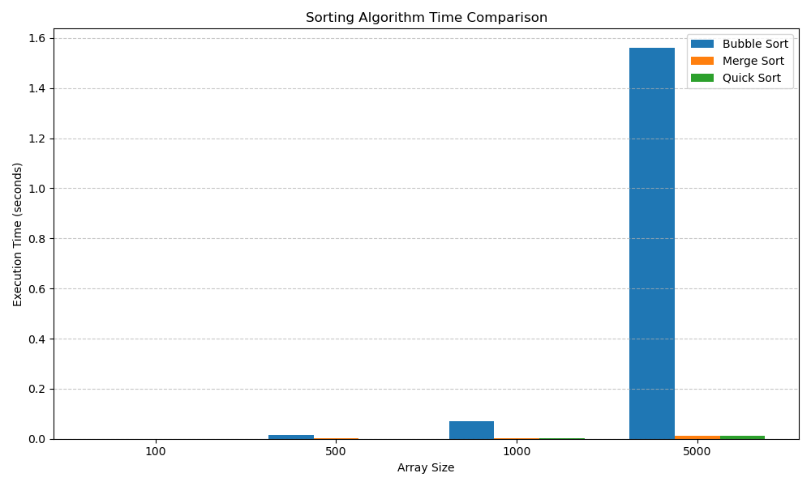

# Sorting Algorithm Benchmark

This project benchmarks the performance of three classic sorting algorithms — **Bubble Sort**, **Merge Sort**, and **Quick Sort** — using Python. It visualizes their runtime performance on randomly generated arrays of various sizes.

## 🚀 Features

- Implements three sorting algorithms:  
  - Bubble Sort  
  - Merge Sort  
  - Quick Sort  
- Measures execution time for each algorithm
- Benchmarks over multiple input sizes (e.g., 100, 500, 1000, 5000 elements)
- Visualizes the results using Matplotlib


## 🧠 Sorting Algorithms

- **Bubble Sort** – Simple but inefficient for large data
- **Merge Sort** – Divide and conquer, stable sort
- **Quick Sort** – Efficient and widely used, average-case O(n log n)

## 📊 Benchmark Visualization

The script uses `matplotlib` to plot a bar chart comparing the runtime of each algorithm on different input sizes:



## 📦 Dependencies

Make sure you have the following installed:

```bash
pip install matplotlib pandas
